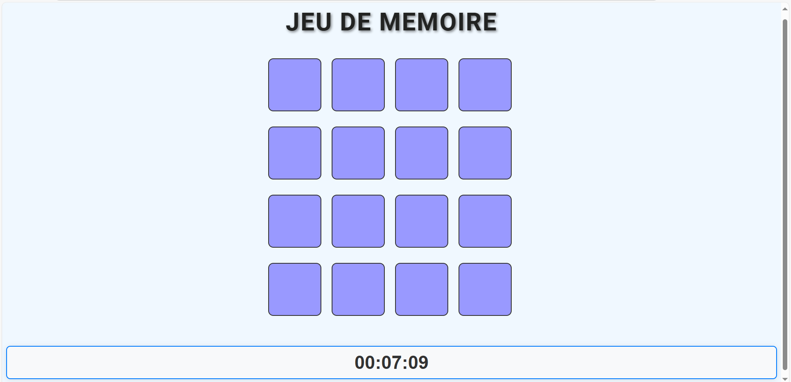
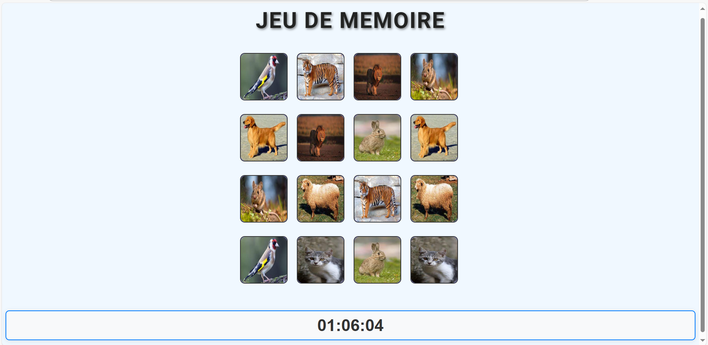

# Jeu de Mémoire - Animaux

Bienvenue dans le **Jeu de Mémoire** ! Ce jeu consiste à retourner des cartes et à associer des paires d'images d'animaux identiques. Le temps nécessaire pour terminer le jeu est calculé et affiché à la fin.

## Description

Le but du jeu est simple : retrouver les paires de cartes qui représentent les mêmes animaux. Les cartes sont placées face cachée au départ. En retournant deux cartes à la fois, l'objectif est de trouver deux cartes avec la même image. Si les cartes sont identiques, elles restent visibles. Si ce n'est pas le cas, elles se retournent à nouveau.

### Fonctionnalités

- **Cartes à retourner** : Le joueur doit retourner les cartes pour découvrir les images.
- **Paires à associer** : Le joueur doit associer les cartes identiques pour les faire disparaître.
- **Calcul du temps** : Le temps écoulé pour terminer le jeu est affiché en secondes.
- **Facile à jouer** : Une interface simple et amusante.

## Aperçu du jeu





## Prérequis

- Un navigateur moderne (comme Google Chrome ou Firefox).
- Le jeu est entièrement fait avec **HTML**, **CSS**, et **JavaScript**.

## Installation

1. **Clonez ce dépôt sur votre ordinateur** :
   ```bash
   git clone https://github.com/raniasouissi/jeu-de-memoire.git
